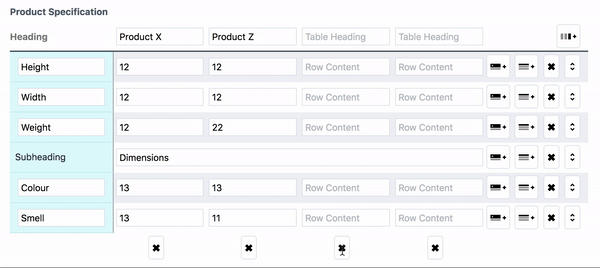

# Table Builder plugin

## Requirements

This plugin requires Craft CMS 3 or later.

## Installation

To install the plugin, follow these instructions.

1. Open your terminal and go to your Craft project:

        cd /path/to/project

2. Then tell Composer to load the plugin:

        composer require ournameismud/tablebuilder

3. In the Control Panel, go to Settings → Plugins and click the “Install” button for Table Builder.

## Table Builder Overview

Simple, client-sided table builder fieldtype for Craft 3

## Configuring Table Builder

TBC

## Using Table Builder

Plugin variables forthcoming

## Table Builder Roadmap

* Clone Row option
* Clone Column option
* Configuration on per-field basis (Field Settings)

Plugin brought to you by [@cole007](http://ournameismud.co.uk/)  
Icon by [Michael Shlain](https://thenounproject.com/search/?q=table&i=203237)